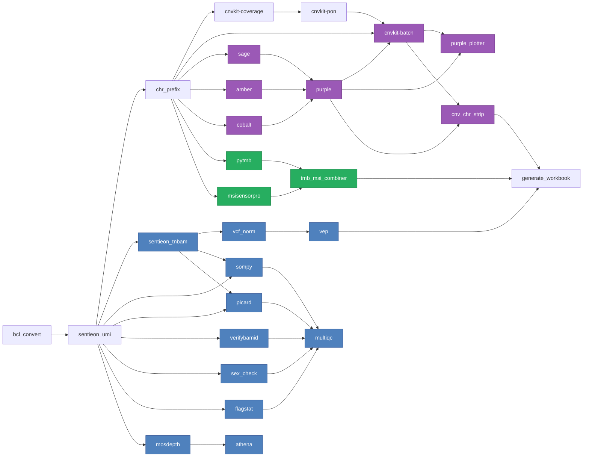

# Atlas Pipeline

### Legend

| Color | Workflow |
|-------|----------|
| 🔵 Blue | atlas_main_workflow |
| 🟣 Purple | atlas_cnv_workflow |
| 🟢 Green | msi_tmb_workflow |

```mermaid
flowchart LR
    bcl_convert --> sentieon_umi
    sentieon_umi --> chr_prefix

    %% CNVs
    chr_prefix --> cnvkit_coverage[cnvkit-coverage]
    cnvkit_coverage --> cnvkit_pon[cnvkit-pon]
    chr_prefix --> cnvkit_batch[cnvkit-batch]
    cnvkit_pon --> cnvkit_batch
    chr_prefix --> sage
    chr_prefix --> amber
    chr_prefix --> cobalt
    sage --> purple
    amber --> purple
    cobalt --> purple
    purple --> cnvkit_batch
    purple --> purple_plotter
    cnvkit_batch --> purple_plotter
    purple --> cnv_chr_strip
    cnvkit_batch --> cnv_chr_strip
    cnv_chr_strip --> generate_workbook
    
    %% TMB and MSI
    chr_prefix --> pytmb
    chr_prefix --> msisensorpro
    pytmb --> tmb_msi_combiner
    msisensorpro --> tmb_msi_combiner
    tmb_msi_combiner --> generate_workbook

    %% Main workflow - SNVs and QC
    sentieon_umi --> sentieon_tnbam
    sentieon_tnbam --> vcf_norm --> vep --> generate_workbook
    sentieon_tnbam --> sompy
    sompy --> multiqc
    sentieon_tnbam --> picard
    picard --> multiqc
    sentieon_umi --> sompy
    sentieon_umi --> picard
    sentieon_umi --> verifybamid --> multiqc
    sentieon_umi --> sex_check --> multiqc
    sentieon_umi --> flagstat --> multiqc
    sentieon_umi --> mosdepth --> athena

    %% Colour coding
    class sentieon_tnbam,vcf_norm,vep,sompy,picard,multiqc,verifybamid,sex_check,flagstat,mosdepth,athena main;
    class sage,amber,cobalt,purple,cnvkit_batch,cnv_chr_strip,purple_plotter cnv;
    class pytmb,msisensorpro,tmb_msi_combiner msi;

    classDef main fill:#4f81bd,stroke:#2f5597,color:#fff;
    classDef cnv fill:#9b59b6,stroke:#6c3483,color:#fff;
    classDef msi fill:#27ae60,stroke:#1e8449,color:#fff;
```

